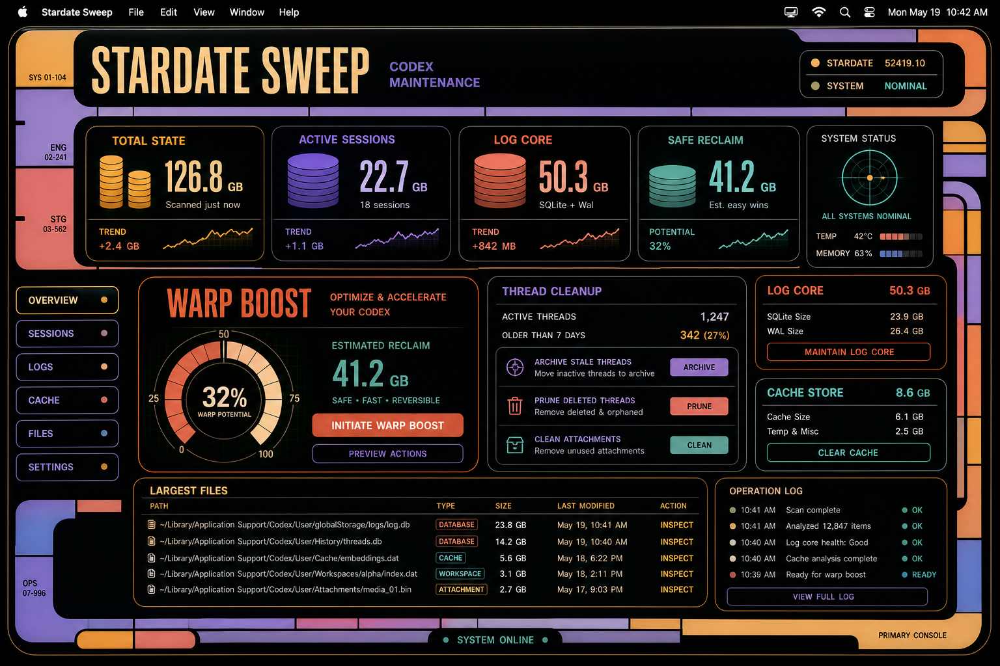

# Codex Refit

Codex Refit is a small macOS helper for people who use Codex a lot and want it to feel snappy again.

It checks the local Codex data on your Mac, shows what is getting heavy, and gives you a simple way to clean up the safe stuff without digging through hidden folders.

## What It Does

- Shows how much local Codex state is on your machine.
- Finds oversized conversations, logs, caches, old crash files, and other local drag.
- Gives you one main **Smart Optimize** button for the usual safe cleanup.
- Keeps advanced controls tucked behind **Hard Mode**.
- Runs a **Speed Check** so you can see whether things are actually improving.
- Includes a **Codex Doctor** panel with plain-language next steps.

## Why It Exists

Codex can slow down when local history, large active conversations, logs, screenshots, worktrees, or background helper processes pile up. Refit does not make the model itself faster. It helps keep the local environment around Codex cleaner, lighter, and easier to understand.

Think of it as a tune-up panel for Codex on your Mac.

## Safety

Codex Refit is intentionally conservative.

- Generated images are **never deleted** by Refit.
- Image folders may be moved out of the active Codex area, but they are preserved.
- Riskier cleanup actions stay locked until you turn on Hard Mode and explicitly enable deletes.
- SQLite changes create backups under the app data directory.
- Refit does not print your conversation text, auth tokens, SSH keys, or provider secrets.
- Refit does not silently rewrite your Codex config.

The default path is meant to be boring in the best way: scan, explain, optimize, and keep your work safe.

## How To Use It

1. Open **Codex Refit**.
2. Click **Scan** if it has not scanned yet.
3. Check the main cards to see what is using space or causing drag.
4. Click **Smart Optimize** for the normal safe cleanup.
5. Run **Speed Check** before and after cleanup to compare.
6. Open **Hard Mode** only when you want more control.

## Easy Mode vs Hard Mode

**Easy Mode** is the normal mode. It keeps the app focused on one-button cleanup and a few clear signals.

**Hard Mode** is for deeper inspection. It shows advanced cleanup options, Doctor details, benchmark drivers, and config recommendations.

## Download

Use the latest macOS build from the [Releases page](https://github.com/RegionallyFamous/codex-refit/releases) when one is attached.

Because this is a local utility app, macOS may warn that it is from an unidentified developer until it is signed and notarized.

## For Developers

Build notes, local commands, packaging steps, safety rules, and the full Codex speed playbook live in the [wiki](https://github.com/RegionallyFamous/codex-refit/wiki).
