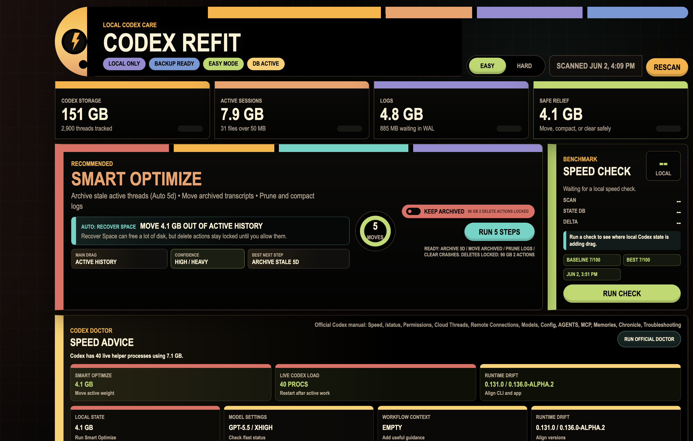

# Codex Refit

Codex is great. Your local Codex folder, after weeks of screenshots, long threads, logs, worktrees, caches, experiments, and "just one more quick task," can become... less great.

**Codex Refit is a little Mac tune-up app for Codex.** It scans the local Codex data on your machine, shows what is getting heavy, and gives you a big friendly button to clean up the safe stuff.

No terminal spelunking. No mystery cleanup script. No "wait, did that delete my generated images?"

## The Big Idea

Codex Refit does not make the model itself faster. It helps the local world around Codex stay lighter.

That means less local drag from oversized conversations, old active history, logs, crash files, rebuildable browser caches, worktrees, and background clutter. When your local Codex state is cleaner, Codex has a better shot at feeling crisp again.

It is basically a refit bay for your Codex install.

## What You Get

- **Smart Optimize**: one recommended cleanup plan for the normal safe stuff.
- **Speed Check**: a before-and-after benchmark so you can see whether things improved.
- **Codex Doctor**: plain-language advice when Refit spots something slowing you down.
- **Easy Mode**: the default view, focused on what matters.
- **Hard Mode**: deeper controls when you want to inspect the machinery.
- **Generated-image safety**: Refit preserves generated images instead of deleting them.

## Why It Is Useful

Codex stores useful local state: conversations, logs, screenshots, app data, worktrees, and more. That is good until it quietly turns into a pile.

Refit helps answer the questions you actually care about:

- Why does Codex feel slower lately?
- What is taking up all this space?
- What can I safely clean?
- Did cleanup actually help?
- Is this a local-state problem, a config problem, or just a big active thread?

## Safety First

The default behavior is intentionally conservative.

- Generated images are **never deleted** by Codex Refit.
- Old generated-image folders may be moved out of the active Codex area, but they are preserved.
- Riskier cleanup stays locked behind Hard Mode and an explicit delete switch.
- SQLite changes create backups under the app data directory.
- Refit does not print your conversation text.
- Refit does not inspect auth tokens, provider secrets, SSH keys, or private credentials.
- Refit does not silently rewrite your Codex config.

The happy path is simple: scan, understand, optimize, check the result.

## How To Use It

1. Open **Codex Refit**.
2. Let it scan your local Codex state.
3. Read the top cards to see what is heavy.
4. Click **Smart Optimize** for the recommended cleanup.
5. Run **Speed Check** before and after if you want proof.
6. Open **Hard Mode** only when you want the deeper controls.

## Download

Grab the signed and notarized macOS DMG from the [Releases page](https://github.com/RegionallyFamous/codex-refit/releases).

The current build is Developer ID signed and notarized by Apple.

## Want The Technical Details?

The build notes, packaging steps, safety model, and full Codex speed playbook live in the [wiki](https://github.com/RegionallyFamous/codex-refit/wiki).
